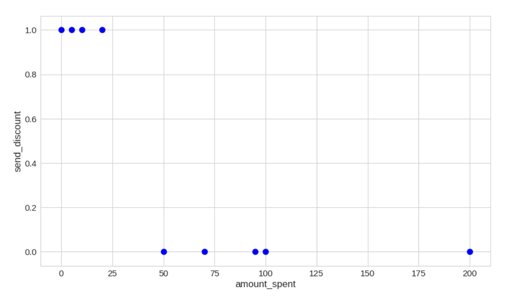

# Smart Discounts with Logistic Regression
**Sending discount codes to selected customers to increase profits**

Let's say we are developing an online clothing store. Some of our customers are already paying full price. Some don't. We want to create a promotional campaign and offer discount codes to some customers in the hopes that this might increase our sales. But we don't want to send discounts to customers which are likely to pay full price. How do we pick the customers that will receive discounts ?

## The Data
We have collected some data from the database called data  

We load the data into a Pandas data frame:
> df = pd.DataFrame.from_dict(data)

  

