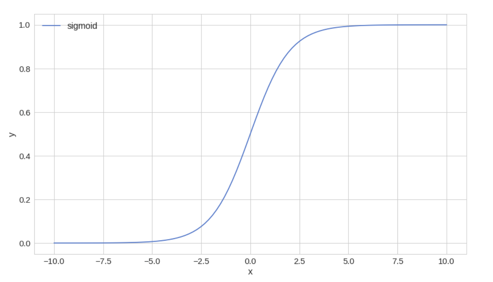

# Smart Discounts with Logistic Regression
**Sending discount codes to selected customers to increase profits**

Let's say we are developing an online clothing store. Some of our customers are already paying full price. Some don't. We want to create a promotional campaign and offer discount codes to some customers in the hopes that this might increase our sales. But we don't want to send discounts to customers which are likely to pay full price. How do we pick the customers that will receive discounts ?

## The Data
We have collected some data from the database called data  

We load the data into a Pandas data frame:
> df = pd.DataFrame.from_dict(data)

  

## Making decision with Logistic regression
Logistic regression is used for classification problems when the dependant/target variable is binary. That is, its values are true or false. Logistic regression is one of the most popular and widely used algorithms in practice.  

Some problems that can be solved with Logistic regression include:  
- Email - deciding spam or not
- Tumor classification - malignant or benign
- Customer upgrade - will the customer buy the premium upgrade or not  

We want to predict the outcome of a variable y, such that : y belongs to {0,1}  
set 0: negative class, and set 1: positive class  

## Why can't we use Linear regression

The result of a Linear regression is not restricted within the [0,1] interval. That makes it very hard to take binary decisions based on its output. Thus, not suitable for our needs.  

### The Logistic Regression model
Given our problem, we want a model that uses 1 variable (predictor) (amount_spent) to predict whether or not we should send a discount to the customer.

> h(x) = w1 . x1 + w0

where w_i are parameters of the model

We can represent this in a more compact form using transpose

We want to build a model that outputs values that are between 0 and 1.

For **Logistic Regression** we want to modify this and introduce another function:
hw(x) = g(w^T . x)

where g(z) = 1  / (1 + e^-z)

g is also know as the **sigmoid function** or the **logistic function**. After substitution, we have -

> hw(x) = 1 / (1 + e^-(w^T . x))

### A closer look at the sigmoid function
Intuitively, we're going to use the sigmoid function over the Linear regression model to bound it within [0; +1]

We translate sigmoid function into python form:
> def sigmoid(z):  
>   return 1 / (1 + np.exp(-z))

**Notice how fast it converges to -1 or +1

## How can we find the parameters for our model?
Let's have a look at a few approaches to find good parameters for our model. But what does good mean in this context?

### Loss function
We have a model that we can use to make decisions, but we still have to find the parameters **'W'**. To do that, we need a measurement of how good a given set of parameters are. For that purpose, we will use a loss (cost) function:

